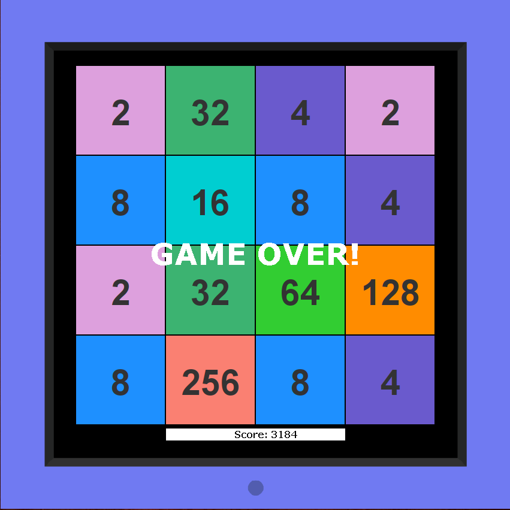
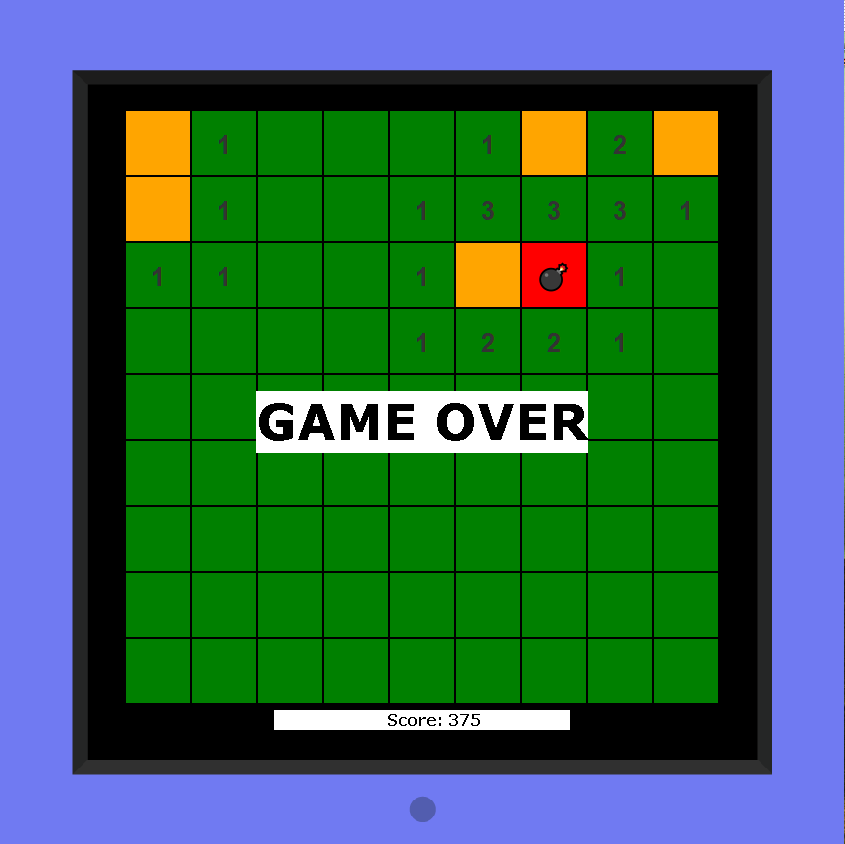

# Games

In this module, I have implemented several small games on the JavaFX engine.

Games like:
- [Game 2048](https://github.com/SergUstin/JavaRushTasks/tree/master/8.Games/src/com/javarush/games/game2048) 
  
- [Minesweeper](https://github.com/SergUstin/JavaRushTasks/tree/master/8.Games/src/com/javarush/games/minesweeper) 
  
- [Snake](https://github.com/SergUstin/JavaRushTasks/tree/master/8.Games/src/com/javarush/games/snake) 
  

