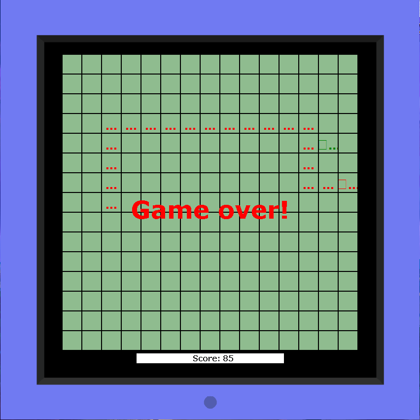

# Games

In this module, I have implemented several small games on the JavaFX engine.

Games like:

  <a href="https://github.com/SergUstin/JavaRushTasks/tree/master/8.Games/src/com/javarush/games/game2048">Game 2048</a>  
  <a href="https://github.com/SergUstin/JavaRushTasks/tree/master/8.Games/src/com/javarush/games/minesweeper">Minesweeper</a> 
  <a href="https://github.com/SergUstin/JavaRushTasks/tree/master/8.Games/src/com/javarush/games/snake">Snake</a>  

  
  
  

