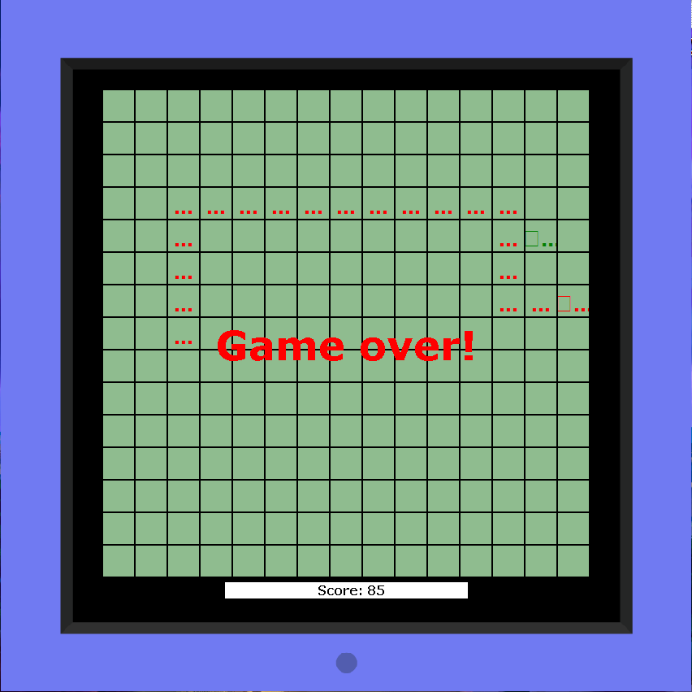

# JavaRushTasks

And this repository contains all the tasks I solved for the JavaRush course. More than 1,500 thousand tasks have been
solved, more than 3,000 hours of Java code writing have been spent.

[Several small JavaFX games have been created](https://github.com/SergUstin/JavaRushTasks/tree/master/8.Games/src/com/javarush/games)

  

      
  

  

                  
  

  

      
  

Several small projects have been implemented, such as:

- [MVC project](https://github.com/SergUstin/JavaRushTasks/tree/master/3.JavaMultithreading/src/com/javarush/task/task36/task3608)
- [About 120 SQL tasks have been solved](https://github.com/SergUstin/JavaRushTasks/tree/master/3.JavaMultithreading/src/com/javarush/task/sql)
- [Chat](https://github.com/SergUstin/JavaRushTasks/tree/master/3.JavaMultithreading/src/com/javarush/task/task30/task3008)
- [Code Refactoring Project](https://github.com/SergUstin/JavaRushTasks/tree/master/3.JavaMultithreading/src/com/javarush/task/task29/task2909)
- [HTML Editor](https://github.com/SergUstin/JavaRushTasks/tree/master/3.JavaMultithreading/src/com/javarush/task/task32/task3209)

The completion of this course is not completed.
I try to rewrite previously solved tasks using modern frameworks and libraries.
